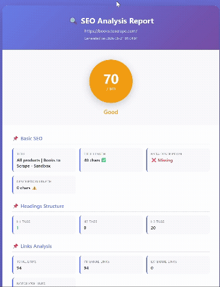

# 🔍 SEO Analyzer

<div align="center">

**A professional Python tool for comprehensive SEO analysis of web pages**

[](https://www.python.org/)
[](LICENSE)
[](https://github.com/astral-sh/uv)
[](https://github.com/psf/black)

[Features](#-features) • [Installation](#-installation) • [Usage](#-usage) • [Examples](#-example-output) • [Roadmap](#-roadmap)

</div>

### Console Output


### HTML Report

---

## 📖 Overview

SEO Analyzer is a powerful command-line tool that performs **comprehensive SEO audits** on any website. Built with Python, it analyzes everything from basic meta tags to advanced technical SEO factors, providing actionable insights to improve your website's search engine ranking.

Whether you're an SEO specialist, web developer, or content creator, this tool helps you:
- ✅ Identify SEO issues instantly
- ✅ Get a detailed SEO score (0-100)
- ✅ Generate professional HTML reports
- ✅ Analyze multiple websites in batch
- ✅ Track SEO metrics over time

---

## ✨ Features

### 🎯 Core Analysis
| Category | What We Check |
|----------|---------------|
| **Basic SEO** | Title tags, Meta descriptions, Keyword optimization |
| **Headings** | H1-H6 structure, hierarchy validation |
| **Links** | Internal/External links, Nofollow detection, Broken links |
| **Images** | Alt text coverage, Missing attributes |
| **Content** | Word count, Paragraph analysis, Content quality |

### 🔧 Technical SEO
- ✅ **HTTPS** - Secure connection verification
- ✅ **Canonical URLs** - Duplicate content prevention
- ✅ **Viewport** - Mobile-friendliness check
- ✅ **Language** - HTML lang attribute validation
- ✅ **Favicon** - Brand presence check
- ✅ **Robots Meta** - Indexability verification
- ✅ **Schema.org** - Structured data detection

### 📊 Performance & Security
- ⚡ **Load Time** - Page speed measurement
- ⚡ **TTFB** - Time to First Byte analysis
- 🔒 **HSTS** - HTTP Strict Transport Security
- 🔒 **CSP** - Content Security Policy
- 🔒 **X-Frame-Options** - Clickjacking protection

### 🌐 Social Media Optimization
- 📘 **Open Graph** - Facebook/LinkedIn optimization
- 🐦 **Twitter Cards** - Twitter sharing optimization

### 🎨 Output Formats
- 📝 **Console** - Beautiful formatted text with emojis
- 📊 **JSON** - Machine-readable for automation
- 🌐 **HTML** - Professional visual reports

### 🚀 Advanced Features
- 📦 **Batch Analysis** - Analyze multiple URLs at once
- 💾 **Auto-Save** - Automatic report saving with timestamps
- 📈 **Summary Reports** - Comparative analysis across sites
- 🎯 **SEO Score** - Overall score with color-coded indicators

---

## 📦 Installation

### Method 1: Using uv (Recommended - Fastest)

```bash
# Install uv if you don't have it
# Linux/macOS
curl -LsSf https://astral.sh/uv/install.sh | sh

# Windows
powershell -ExecutionPolicy ByPass -c "irm https://astral.sh/uv/install.ps1 | iex"

# Clone the repository
git clone https://github.com/pouriya-py/seo-analyzer.git
cd seo-analyzer

# Install dependencies
uv sync
```

### Method 2: Using pip

```bash
# Clone the repository
git clone https://github.com/pouriya-py/seo-analyzer.git
cd seo-analyzer

# Create virtual environment
python -m venv venv

# Activate virtual environment
# Linux/macOS
source venv/bin/activate
# Windows
venv\Scripts\activate

# Install dependencies
pip install -e .
```

---

## 🚀 Usage

### Basic Commands

```bash
# Analyze a single URL (console output)
uv run seo-analyze https://example.com

# Generate JSON output
uv run seo-analyze https://example.com --json

# Generate HTML report
uv run seo-analyze https://example.com --html

# Save HTML report with custom filename
uv run seo-analyze https://example.com --html -o my_report.html
```

### Batch Analysis

```bash
# Analyze multiple URLs from command line
uv run seo-analyze https://example.com https://google.com https://github.com -o reports/

# Analyze URLs from a text file
uv run seo-analyze --file urls.txt -o reports/ --html

# Generate both JSON and HTML reports
uv run seo-analyze --file urls.txt -o reports/ --html
```

### Creating a URL List

Create a file named `urls.txt`:

```txt
# My websites to analyze
https://example.com
https://google.com
https://github.com
https://en.wikipedia.org/wiki/Python_(programming_language)
```

Then run:

```bash
uv run seo-analyze --file urls.txt -o reports/ --html
```

---

## 📊 Example Output

### Console Report

```
======================================================================
📊 SEO Report for: https://example.com
======================================================================

🟡 SEO SCORE: 63/100
──────────────────────────────────────────────────────────────────────

📌 BASIC SEO
──────────────────────────────────────────────────────────────────────
  Title: Example Domain
  Title Length: 14 chars ⚠️
  Meta Description: ❌ Missing

📌 HEADINGS
──────────────────────────────────────────────────────────────────────
  H1: 1  |  H2: 0  |  H3: 0

📌 LINKS
──────────────────────────────────────────────────────────────────────
  Total: 1  |  Internal: 0  |  External: 1  |  Nofollow: 0

📌 IMAGES
──────────────────────────────────────────────────────────────────────
  Total: 0  |  With Alt: 0 ✅  |  Without Alt: 0 ❌

📌 CONTENT
──────────────────────────────────────────────────────────────────────
  Word Count: 25
  Paragraphs: 1

📌 TECHNICAL
──────────────────────────────────────────────────────────────────────
  HTTPS: ✅ Yes
  Page Size: 0.55 KB ✅
  Load Time: 0.45s  |  TTFB: 0.12s
  Viewport: ✅ Yes
  Canonical: ❌ No
  Language: en
  Favicon: ✅ Yes
  Indexable: ✅ Yes

📌 SECURITY
──────────────────────────────────────────────────────────────────────
  HSTS: ✅ Yes
  CSP: ❌ No
  X-Frame-Options: ✅ Yes

📌 SOCIAL MEDIA
──────────────────────────────────────────────────────────────────────
  Open Graph: ❌ No
  Twitter Card: ❌ No

📌 STRUCTURED DATA
──────────────────────────────────────────────────────────────────────
  ❌ No Schema.org markup found

📌 SUMMARY
──────────────────────────────────────────────────────────────────────
  ❌ Issues (1):
     • Missing meta description
  ⚠️  Warnings (4):
     • Title is too short (14 chars, recommended: 30-60)
     • Missing Open Graph tags (for social media)
     • Missing Twitter Card tags
     • No Schema.org markup found
  ✅ Passed (5):
     • H1 tag structure is correct
     • Viewport meta tag is set (mobile-friendly)
     • Language attribute is set (en)
     • Favicon is set
     • Page is indexable (no robots meta restrictions)

======================================================================
```

### HTML Report

The HTML report provides a beautiful, responsive visualization with:
- 🎨 Modern gradient design
- 📊 Visual score indicator with color coding
- 📱 Mobile-friendly layout
- 📋 Detailed breakdown of all metrics
- 💡 Actionable recommendations

---

## 🧪 Testing

Test the tool with these sample URLs:

```bash
# Simple test site
uv run seo-analyze https://example.com

# E-commerce sandbox
uv run seo-analyze https://books.toscrape.com/

# Large website
uv run seo-analyze https://en.wikipedia.org/wiki/Python_(programming_language)
```

---

## 🛠 Development

### Setup Development Environment

```bash
# Install with dev dependencies
uv sync --dev

# Format code with Black
uv run black src/

# Check code with Ruff
uv run ruff check src/

# Run tests (when available)
uv run pytest
```

### Project Structure

```
seo-analyzer/
├── src/
│   └── seo_analyzer/
│       ├── __init__.py              # Package initialization
│       ├── analyzer.py              # Core SEO analysis logic
│       ├── cli.py                   # Command-line interface
│       └── report_generator.py      # HTML report generation
├── tests/                           # Test suite (future)
├── reports/                         # Generated reports (gitignored)
├── pyproject.toml                   # Project configuration
├── README.md                        # This file
├── LICENSE                          # MIT License
└── .gitignore                       # Git ignore rules
```

---

## 📈 SEO Score Breakdown

The SEO score (0-100) is calculated based on:

| Factor | Points | Description |
|--------|--------|-------------|
| Title Tag | 15 | Presence and optimal length (30-60 chars) |
| Meta Description | 15 | Presence and optimal length (120-160 chars) |
| H1 Tag | 10 | Single H1 tag present |
| HTTPS | 10 | Secure connection |
| Viewport | 10 | Mobile-friendly |
| Images Alt | 10 | All images have alt text |
| Canonical | 5 | Canonical URL set |
| Language | 5 | HTML lang attribute |
| Open Graph | 5 | Social media tags |
| Schema.org | 5 | Structured data |
| Indexable | 10 | Not blocked by robots |

**Score Interpretation:**
- 🟢 **80-100**: Excellent - Well optimized
- 🟡 **60-79**: Good - Minor improvements needed
- 🟠 **40-59**: Needs Work - Several issues found
- 🔴 **0-39**: Poor - Critical SEO problems

---

## 🔮 Roadmap

### Phase 1: Core Features ✅
- [x] Basic SEO analysis
- [x] Technical SEO checks
- [x] HTML report generation
- [x] Batch analysis
- [x] JSON output

### Phase 2: Advanced Analysis (Coming Soon)
- [ ] JavaScript rendering with Playwright
- [ ] Core Web Vitals integration (LCP, INP, CLS)
- [ ] Sitemap.xml analysis
- [ ] Robots.txt validation
- [ ] Internal linking structure analysis

### Phase 3: Intelligence (Future)
- [ ] Content quality analysis with NLP
- [ ] Keyword density analysis
- [ ] Readability scoring
- [ ] Competitor comparison
- [ ] Google Search Console API integration

### Phase 4: Enterprise (Future)
- [ ] Web dashboard with FastAPI
- [ ] Automated monitoring & alerts
- [ ] Historical trend analysis
- [ ] Multi-user support
- [ ] API for SaaS integration

---

## 🤝 Contributing

Contributions are what make the open source community amazing! Any contributions you make are **greatly appreciated**.

1. Fork the Project
2. Create your Feature Branch (`git checkout -b feature/AmazingFeature`)
3. Commit your Changes (`git commit -m 'Add some AmazingFeature'`)
4. Push to the Branch (`git push origin feature/AmazingFeature`)
5. Open a Pull Request

---

## 📝 License

Distributed under the MIT License. See `LICENSE` for more information.

---

## 👤 Author

**Pouriya Bavinejad**

- 📧 Email: [pouriya.pouriya@gmail.com](mailto:pouriya.pouriya@gmail.com)
- 💼 LinkedIn: [pouriya-bavinejad](https://www.linkedin.com/in/pouriya-bavinejad-591078417)
- 🐙 GitHub: [@pouriya-py](https://github.com/pouriya-py)

---

## 🙏 Acknowledgments

- [BeautifulSoup](https://www.crummy.com/software/BeautifulSoup/) - HTML parsing library
- [Requests](https://requests.readthedocs.io/) - HTTP library for Python
- [uv](https://github.com/astral-sh/uv) - Fast Python package installer
- [Black](https://github.com/psf/black) - Python code formatter
- [Ruff](https://github.com/astral-sh/ruff) - Fast Python linter

---

## ⭐ Show your support

Give a ⭐️ if this project helped you!

---

<div align="center">

**Built with ❤️ by [Pouriya Bavinejad](https://github.com/pouriya-py)**

*Made for the SEO community*

</div>